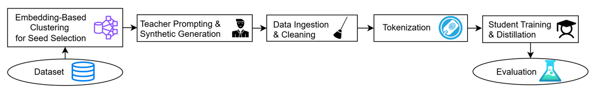

# efficient-financial-distillation

Code for the LREC 2026 paper:

**Efficient Financial Language Understanding via Distillation with Synthetic Data**



This repository contains code for a low-resource financial sentiment classification pipeline built around:

- seed example selection
- synthetic data generation with prompt templates
- teacher-model evaluation
- compact student-model training
- result analysis and visualization

The project studies whether carefully selected seed examples and LLM-generated synthetic data can improve compact student models on financial sentiment tasks under limited real-data settings.

---

## Broader research relevance

Although the experiments in this repository focus on financial sentiment analysis, the underlying methodology is intended for broader low-resource and privacy-constrained AI settings. In particular, the framework for clustering-based seed selection, synthetic data generation, and compact model distillation is relevant to domains where labeled data are limited, deployment efficiency matters, and reliable decision support is important, including healthcare monitoring and critical infrastructure applications.

---

## How to run

Below are example commands for the main pipeline stages.

### 1. Synthetic data generation

```bash
python scripts/generation/generate_synthetic.py --dataset phrasebank
python scripts/generation/generate_synthetic.py --dataset twitter
```

### 2. GPT-4o evaluation

```bash
python scripts/generation/chatgpt4o_eval.py --dataset phrasebank
python scripts/generation/chatgpt4o_eval.py --dataset twitter
```

### 3. Seed selection

```bash
python scripts/seed_selection/SaveSeed_financial_phrasebank.py
python scripts/seed_selection/SaveRandomSeed_financial_phrasebank.py
python scripts/seed_selection/SaveSeed_twitter-financial-news.py
python scripts/seed_selection/SaveRandomSeed_twitter-financial-news.py
```

### 4. Seed distance visualization

```bash
python scripts/seed_selection/visualize_seed_distances.py
python scripts/seed_selection/visualize_Randomseed_distances.py
```

### 5. Student model training

Examples:

```bash
python scripts/training/DistilBERT_financial_phrasebank.py
python scripts/training/TinyBERT_financial_phrasebank.py
python scripts/training/ModernBERT_financial_phrasebank.py

python scripts/training/DistilBERT_twitter-financial-news.py
python scripts/training/TinyBERT_twitter-financial-news.py
python scripts/training/ModernBERT_twitter-financial-news.py
```

Synthetic-data variants are also included in `scripts/training/`.

### 6. Evaluation and comparison

Examples:

```bash
python scripts/evaluation/FinBert_test.py
python scripts/evaluation/test_phrasebank_plot.py
python scripts/evaluation/test_twitter_plot.py
python scripts/evaluation/test_phrasebank_modernBERT.py
python scripts/evaluation/test_twitterNews_modernBERT.py
python scripts/evaluation/Plot_comparison.py
python scripts/evaluation/mcnemar_twitter.py
```

---

## Installation

Create and activate a Python environment, then install dependencies:

```bash
pip install -r requirements.txt
```

If you use OpenAI-based generation or evaluation, store your API key as an environment variable instead of hardcoding it.

### Windows CMD

```bash
set OPENAI_API_KEY=your_key_here
```

### PowerShell

```bash
$env:OPENAI_API_KEY="your_key_here"
```

### macOS / Linux

```bash
export OPENAI_API_KEY=your_key_here
```

---

## Tasks and datasets

This repository currently focuses on two financial sentiment datasets:

- Financial PhraseBank
- Twitter Financial News Sentiment

---

## Method overview

The pipeline is organized into the following stages:

1. **Seed selection**  
   Select representative seed examples using clustering-based sampling or random sampling.

2. **Synthetic data generation**  
   Use prompt templates and an LLM to generate additional sentiment-labeled financial text from seed examples.

3. **Teacher / reference model evaluation**  
   Evaluate strong pretrained or API-based models such as FinBERT or GPT-4o.

4. **Student model training**  
   Train compact models such as DistilBERT, TinyBERT, and ModernBERT on:
   - real seed data only
   - synthetic-augmented data
   - clustered-seed and random-seed variants

5. **Evaluation and comparison**  
   Compare performance across datasets, model families, and settings using metrics, plots, and statistical tests.

---

## Repository structure

```text
efficient-financial-distillation/
├─ README.md
├─ LICENSE
├─ .gitignore
├─ .ai/
├─ appendix/
├─ configs/
├─ data/
├─ Demo/
├─ docs/
├─ literature/
├─ Literature_review/
├─ outputs/
├─ prompts/
├─ scripts/
│  ├─ evaluation/
│  │  ├─ FinBert_test.py
│  │  ├─ mcnemar_twitter.py
│  │  ├─ Plot_comparison.py
│  │  ├─ test_phrasebank_modernBERT.py
│  │  ├─ test_phrasebank_plot.py
│  │  ├─ test_twitter_plot.py
│  │  └─ test_twitterNews_modernBERT.py
│  ├─ generation/
│  │  ├─ chatgpt4o_eval.py
│  │  └─ generate_synthetic.py
│  ├─ misc/
│  ├─ seed_selection/
│  │  ├─ SaveRandomSeed_financial_phrasebank.py
│  │  ├─ SaveRandomSeed_twitter-financial-news.py
│  │  ├─ SaveSeed_financial_phrasebank.py
│  │  ├─ SaveSeed_twitter-financial-news.py
│  │  ├─ visualize_Randomseed_distances.py
│  │  └─ visualize_seed_distances.py
│  └─ training/
│     ├─ DistilBERT_financial_phrasebank.py
│     ├─ DistilBERT_synthetic_financial_phrasebank.py
│     ├─ DistilBERT_synthetic_financial_phrasebank_randomSeed.py
│     ├─ DistilBERT_synthetic_twitter-financial-news.py
│     ├─ DistilBERT_synthetic_twitter-financial-news_randomSeed.py
│     ├─ DistilBERT_twitter-financial-news.py
│     ├─ ModernBERT_financial_phrasebank.py
│     ├─ ModernBERT_synthetic_financial_phrasebank.py
│     ├─ ModernBERT_synthetic_financial_phrasebank_randomSeed.py
│     ├─ ModernBERT_synthetic_twitter-financial-news.py
│     ├─ ModernBERT_synthetic_twitter-financial-news_randomSeed.py
│     ├─ ModernBERT_twitter-financial-news.py
│     ├─ TinyBERT_financial_phrasebank.py
│     ├─ TinyBERT_synthetic_financial_phrasebank.py
│     ├─ TinyBERT_synthetic_financial_phrasebank_randomSeed.py
│     ├─ TinyBERT_synthetic_twitter-financial-news.py
│     ├─ TinyBERT_synthetic_twitter-financial-news_randomSeed.py
│     └─ TinyBERT_twitter-financial-news.py
```

---

## Notes

This repository currently contains both refactored scripts and legacy experiment-specific scripts. The main pipeline has begun to be reorganized into `generation`, `seed_selection`, `training`, and `evaluation`, but some older experiment files are still kept for reproducibility and comparison.

---

## Citation

If you use this repository, please cite the associated paper.

```bibtex
@inproceedings{huang2026efficient,
  title={Efficient Financial Language Understanding via Distillation with Synthetic Data},
  author={Huang, Wen-Fong and Simpson, Edwin},
  booktitle={Proceedings of the 2026 Joint International Conference on Computational Linguistics, Language Resources and Evaluation (LREC-COLING 2026)},
  year={2026}
}
```

---

## License

This project is released under the MIT License.
