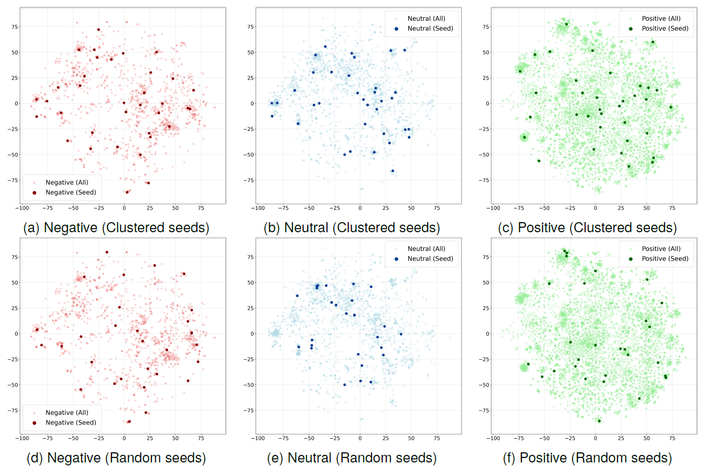
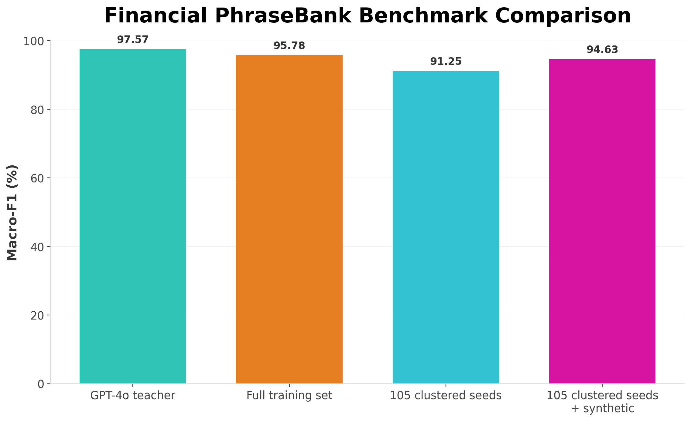
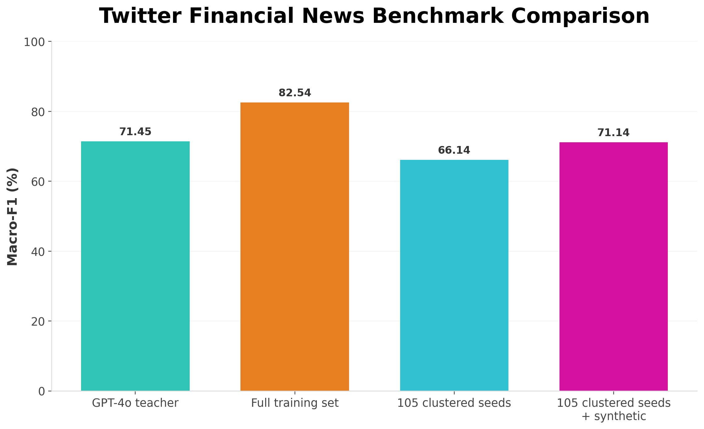
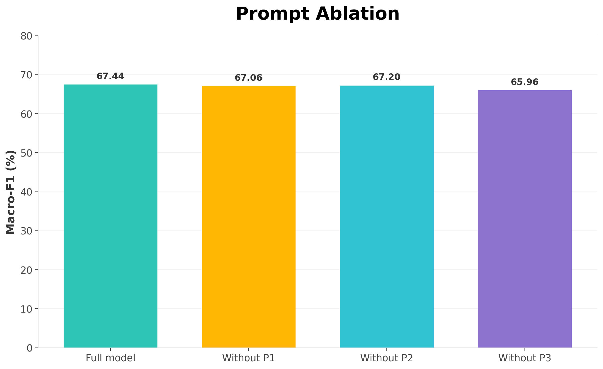
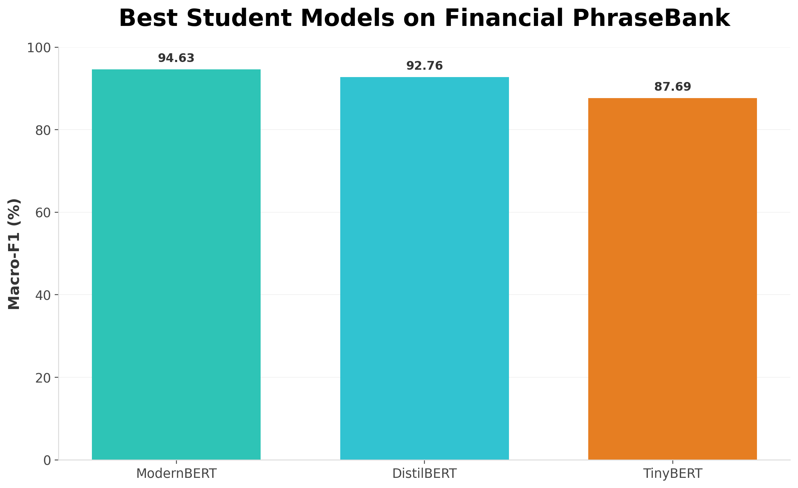
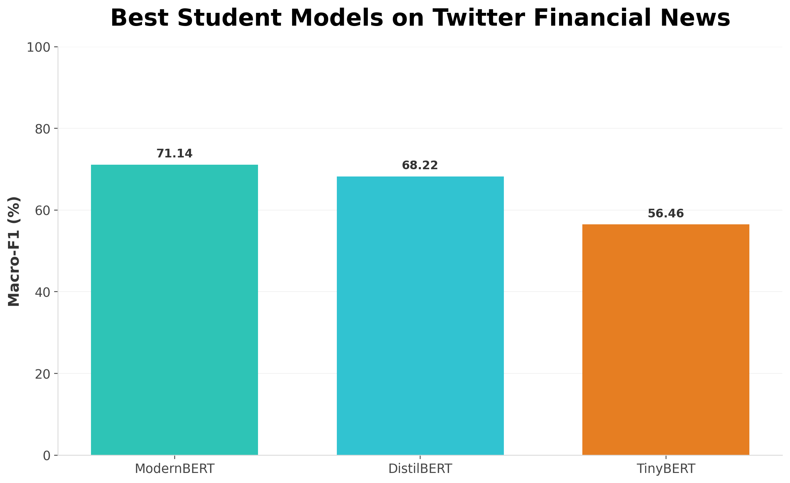
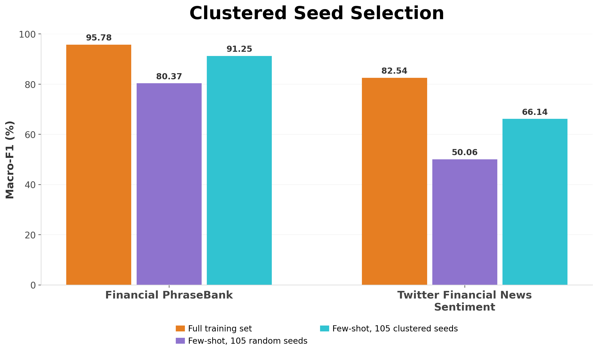
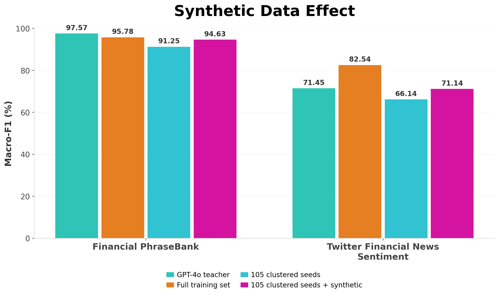

# efficient-financial-distillation

Code for the LREC 2026 paper:

**Efficient Financial Language Understanding via Distillation with Synthetic Data**


This repository contains code for a reproducible, low-resource financial sentiment classification pipeline built around:

- embedding-based seed selection
- structured synthetic data generation with prompt templates
- teacher-model evaluation
- compact student-model training
- result analysis and visualization

The project studies whether a small number of carefully selected real examples, expanded through structured prompting of a large teacher model, can transfer useful task knowledge to compact student models under limited-data conditions.

---

## Why this problem matters

Financial sentiment analysis is useful for market monitoring and decision-support, but high-quality labelled data are often limited by confidentiality, domain expertise requirements, and annotation cost. In many realistic settings, direct large-scale human labelling is expensive, slow, or operationally difficult. At the same time, large instruction-following models can perform strongly on language tasks, but their computational demands, latency, and deployment cost make them harder to rely on in resource-sensitive settings.

This repository studies a practical alternative: whether a small number of representative labelled examples can be expanded into an effective training signal for compact task-specific models. The goal is not only strong benchmark performance, but also a more practical route to domain adaptation when labelled data are scarce, sensitive, or costly to curate.

## Why data-efficient distillation matters

The core idea in this repository is to reduce dependence on large fully labelled datasets by combining representative seed selection, structured synthetic data generation, and compact model training. Instead of requiring extensive manual annotation, the pipeline starts from a small seed set, expands coverage through prompting, and transfers useful task behaviour to smaller student models such as DistilBERT, TinyBERT, and ModernBERT.

This makes the approach relevant to settings where labelled data are expensive, privacy-constrained, or difficult to share. In such cases, a compact task-specific model may be more practical than repeated dependence on a large general-purpose model, especially when efficient deployment, controlled adaptation, and reproducible evaluation matter.

## Relevance to broader research directions

Although the experiments in this repository focus on financial sentiment classification, the methodology is relevant to broader low-resource and privacy-constrained AI settings. The central pattern developed here—representative seed selection, structured synthetic expansion, and compact student distillation—is transferable to language-based monitoring and decision-support workflows where labelled data are limited and reliable deployment matters.

This is especially relevant for environments where data access is restricted, annotation is expensive, and robust model behaviour matters more than simply scaling model size. Similar constraints arise in privacy-sensitive financial text, clinical language, patient-reported feedback, incident reports, maintenance logs, and other high-stakes settings where direct large-scale annotation may be costly or operationally impractical. In that sense, this repository demonstrates a transferable methodology for data-efficient AI adaptation rather than only a single benchmark result.

## Evidence from the paper

The accompanying paper provides direct evidence that this low-resource pipeline can recover strong performance with very limited human-labelled input:

- The framework is explicitly designed for **low-resource conditions**, starting from only **12 to 105 human-labelled seed sentences**.
- On **Financial PhraseBank**, ModernBERT trained with **105 clustered seeds + synthetic data** achieved **95.15% accuracy / 94.63 macro-F1**, while using **under 6% of the original human-annotated data**.
- On the same dataset, this low-resource synthetic setting came within approximately **2.2 points** of the **GPT-4o zero-shot teacher** and also approached the performance of the **full-data ModernBERT** baseline.
- On **Twitter Financial News Sentiment**, ModernBERT trained on **clustered seeds + synthetic data** achieved **77.14% accuracy / 71.14 macro-F1**, surpassing the **GPT-4o zero-shot teacher** on accuracy in the noisier domain.
- The paper further reports that this Twitter improvement over the teacher is **statistically significant** under McNemar's test (**p = 0.0087**).
- Across both datasets, **clustering-based seed selection** consistently outperformed random selection, showing that representative data selection materially improves low-resource synthetic expansion.

These results support the broader claim that compact, task-specific models can become highly competitive when trained through carefully designed data-efficient distillation pipelines, without requiring large manually labelled corpora.

---

## Key Results

- On **Financial PhraseBank**, ModernBERT trained with **clustered seeds + synthetic data** achieved **95.15% accuracy / 94.63 macro-F1**, approaching both the **full-data ModernBERT** result (**96.48 / 95.78**) and the **GPT-4o zero-shot teacher** (**97.35 / 97.57**) while using **under 6% of the original human-annotated data**.
- On **Twitter Financial News Sentiment**, the same low-resource setting achieved **77.14% accuracy / 71.14 macro-F1**, outperforming the **GPT-4o zero-shot teacher** on accuracy (**72.78%**) and remaining competitive on macro-F1 in a noisier domain.
- **Clustering-based seed selection** consistently outperformed random seed selection in low-resource settings, demonstrating that semantic representativeness matters.
- Prompt ablation showed that each template contributed useful diversity, with the largest performance drop observed when the **multi-seed template** was removed.
- The overall findings show that structured synthetic expansion can substantially improve compact student models under limited-data conditions, making low-resource adaptation more practical and reproducible.

---

## Results Snapshot

The repository includes experiments on two financial sentiment datasets: one formal and expert-annotated (**Financial PhraseBank**), and one shorter and noisier (**Twitter Financial News Sentiment**). The comparison below highlights the main progression of the method: from full-data training, to low-resource clustered seeds, to clustered seeds plus synthetic expansion.

| Dataset | Setting | Model | Accuracy (%) | Macro-F1 (%) |
|---|---|---:|---:|---:|
| Financial PhraseBank | Full training set | ModernBERT | 96.48 | 95.78 |
| Financial PhraseBank | 105 clustered seeds | ModernBERT | 92.51 | 91.25 |
| Financial PhraseBank | 105 clustered seeds + synthetic | ModernBERT | 95.15 | 94.63 |
| Financial PhraseBank | GPT-4o teacher (zero-shot) | GPT-4o | 97.35 | 97.57 |
| Twitter Financial News Sentiment | Full training set | ModernBERT | 86.60 | 82.54 |
| Twitter Financial News Sentiment | 105 clustered seeds | ModernBERT | 74.20 | 66.14 |
| Twitter Financial News Sentiment | 105 clustered seeds + synthetic | ModernBERT | 77.14 | 71.14 |
| Twitter Financial News Sentiment | GPT-4o teacher (zero-shot) | GPT-4o | 72.78 | 71.45 |

These results show that structured synthetic expansion can substantially improve compact student models in low-resource settings, and that semantically representative seed selection matters.

---

## Visual Results

### Seed coverage and selection strategy

The figure below illustrates the difference between clustering-based seed selection and random sampling in the shared embedding space. Across negative, neutral, and positive classes, clustered seeds provide broader and more even coverage of the data distribution, which helps support more diverse synthetic generation and stronger downstream performance than random seed selection.



### Financial PhraseBank benchmark comparison

This figure summarizes the main performance story on the formal financial dataset. It compares the teacher model, full-data training, clustered-seed training, and clustered-seed-plus-synthetic training for ModernBERT. The comparison shows that clustered seeds already provide strong low-resource performance, while adding synthetic data narrows the gap to the teacher and approaches full-data training performance.



### Twitter Financial News benchmark comparison

This figure summarizes the corresponding benchmark story on the noisier Twitter financial dataset. It compares the same four settings for ModernBERT and shows that clustered-seed-plus-synthetic training substantially improves over clustered seeds alone, surpasses the zero-shot teacher on accuracy, and remains competitive on noisy financial text.



### Prompt ablation

This figure summarizes the effect of removing individual prompt templates from the synthetic data pipeline. The combined prompt design performs best overall, and the drop after removing individual templates shows that each prompt contributes complementary value rather than serving as a redundant variation.



### Student model comparison

These figures compare the best-performing student architectures under the clustered-seed-plus-synthetic setting. They highlight that ModernBERT is the strongest student model overall, while DistilBERT also remains competitive and TinyBERT provides a smaller, lighter baseline.





### Overview: clustered seed selection

This overview figure summarizes the difference between full-data training, few-shot random seed selection, and few-shot clustered seed selection across both datasets. It provides a compact visual summary of why clustered seeds are a stronger low-resource starting point than random seeds.



### Overview: synthetic data effect

This overview figure summarizes the broader effect of synthetic expansion across both datasets, comparing the teacher, full-data training, clustered seeds alone, and clustered seeds plus synthetic data. It serves as a high-level visual summary of the project's main message.



---

## Workflow overview

The workflow implemented in this repository follows the pipeline shown above:

1. **Embedding-based clustering for seed selection**  
   Select representative examples from the original dataset using clustering-based or random seed selection.

2. **Teacher prompting and synthetic generation**  
   Use prompt templates and teacher models to generate additional labelled financial text from the selected seeds.

3. **Data ingestion and cleaning**  
   Normalize text, clean labels, merge seed and synthetic data when needed, and prepare train/validation/test splits.

4. **Tokenization**  
   Convert text into model-ready inputs for compact student models.

5. **Student training and distillation**  
   Train compact models such as DistilBERT, TinyBERT, and ModernBERT under full-data, seed-only, or synthetic-plus-seed settings.

6. **Evaluation**  
   Compare models and settings using test metrics, plots, and statistical comparison scripts.

---

## Quick start

### 1. Synthetic data generation

```bash
python scripts/generation/generate_synthetic.py --dataset phrasebank
python scripts/generation/generate_synthetic.py --dataset twitter
```

### 2. GPT-4o evaluation

```bash
python scripts/generation/chatgpt4o_eval.py --dataset phrasebank
python scripts/generation/chatgpt4o_eval.py --dataset twitter
```

### 3. Seed selection

```bash
python scripts/seed_selection/SaveSeed_financial_phrasebank.py
python scripts/seed_selection/SaveRandomSeed_financial_phrasebank.py
python scripts/seed_selection/SaveSeed_twitter-financial-news.py
python scripts/seed_selection/SavedandomSeed_twitter-financial-news.py
```

### 4. Seed distance visualization

```bash
python scripts/seed_selection/visualize_seed_distances.py
python scripts/seed_selection/visualize_Randomseed_distances.py
```

### 5. Student model training

PhraseBank examples:

```bash
python scripts/training/Distilbert_phrasebank_trainer.py --mode full
python scripts/training/Modernbert_phrasebank_trainer.py --mode full
python scripts/training/Tinybert_phrasebank_trainer.py --mode full
```

Twitter Financial News examples:

```bash
python scripts/training/Distilbert_twitter_trainer.py --mode full
python scripts/training/Modernbert_twitter_trainer.py --mode full
python scripts/training/Tinybert_twitter_trainer.py --mode full
```

Synthetic + seed examples:

```bash
python scripts/training/Distilbert_phrasebank_trainer.py --mode synthetic --seed-source jsonl --seed-jsonl ../outputs/seed_data.jsonl --synthetic-jsonl ../outputs/synthetic_data_from_Seed.jsonl --use-early-stopping

python scripts/training/Modernbert_twitter_trainer.py --mode synthetic --seed-source jsonl --seed-jsonl ../outputs/seed_data.jsonl --synthetic-jsonl ../outputs/synthetic_data_from_Seed.jsonl --use-early-stopping

python scripts/training/Tinybert_twitter_trainer.py --mode synthetic --seed-source jsonl --seed-jsonl ../outputs/seed_data.jsonl --synthetic-jsonl ../outputs/synthetic_data_from_Seed.jsonl --use-early-stopping
```

### 6. Evaluation and comparison

```bash
python scripts/evaluation/FinBert_test.py
python scripts/evaluation/test_phrasebank_plot.py
python scripts/evaluation/test_twitter_plot.py
python scripts/evaluation/test_phrasebank_modernBERT.py
python scripts/evaluation/test_twitterNews_modernBERT.py
python scripts/evaluation/Plot_comparison.py
python scripts/evaluation/mcnemar_twitter.py
```

---

## Installation

Create and activate a Python environment, then install the packages used by the current scripts:

```bash
pip install torch transformers datasets evaluate sentence-transformers scikit-learn pandas numpy matplotlib openai tqdm
```

If you use OpenAI-based generation or evaluation, store your API key as an environment variable instead of hardcoding it.

### Windows CMD

```bash
set OPENAI_API_KEY=your_key_here
```

### PowerShell

```bash
$env:OPENAI_API_KEY="your_key_here"
```

### macOS / Linux

```bash
export OPENAI_API_KEY=your_key_here
```

---

## Tasks and datasets

This repository currently focuses on two financial sentiment datasets:

- Financial PhraseBank
- Twitter Financial News Sentiment

### Financial PhraseBank

A relatively formal, expert-annotated financial sentiment dataset built from company reports, press releases, and business news. It is useful for testing whether the pipeline can remain competitive on cleaner and more structured financial text.

### Twitter Financial News Sentiment

A noisier dataset containing shorter, more variable financial posts and news-like social text. It is useful for testing whether structured synthetic expansion and clustering-based seed selection improve robustness under more realistic low-resource conditions.

---

## Repository structure

```text
efficient-financial-distillation/
├─ README.md
├─ LICENSE
├─ .gitignore
├─ Demo/
│  └─ app.py
├─ docs/
│  ├─ method_pipeline.png
│  ├─ seed_selection_tsne.png
│  ├─ results_phrasebank1.png
│  ├─ results_twitter1.png
│  ├─ prompt_ablation1.png
│  ├─ best_student_phrasebank1.png
│  ├─ best_student_twitter1.png
│  ├─ clustered_seed_selection_overview1.png
│  └─ synthetic_data_overview1.png
├─ literature/
├─ outputs/
├─ prompts/
│  ├─ template1.txt
│  ├─ template2.txt
│  └─ template3.txt
└─ scripts/
   ├─ evaluation/
   │  ├─ FinBert_test.py
   │  ├─ mcnemar_twitter.py
   │  ├─ Plot_comparison.py
   │  ├─ test_phrasebank_modernBERT.py
   │  ├─ test_phrasebank_plot.py
   │  ├─ test_twitter_plot.py
   │  └─ test_twitterNews_modernBERT.py
   ├─ generation/
   │  ├─ chatgpt4o_eval.py
   │  └─ generate_synthetic.py
   ├─ seed_selection/
   │  ├─ SavedandomSeed_twitter-financial-news.py
   │  ├─ SaveRandomSeed_financial_phrasebank.py
   │  ├─ SaveSeed_financial_phrasebank.py
   │  ├─ SaveSeed_twitter-financial-news.py
   │  ├─ visualize_Randomseed_distances.py
   │  └─ visualize_seed_distances.py
   └─ training/
      ├─ Distilbert_phrasebank_trainer.py
      ├─ Distilbert_twitter_trainer.py
      ├─ Modernbert_phrasebank_trainer.py
      ├─ Modernbert_twitter_trainer.py
      ├─ Tinybert_phrasebank_trainer.py
      └─ Tinybert_twitter_trainer.py
```

---

## Reproducing the main README figures

The figures used in this README are:

1. `seed_selection_tsne.png`  
   Shows why clustered seeds are more representative than random seeds.

2. `results_phrasebank1.png`  
   Summarizes the main benchmark story on the formal dataset.

3. `results_twitter1.png`  
   Summarizes the benchmark story on noisy financial text.

4. `prompt_ablation1.png`  
   Demonstrates that the prompt templates each contribute useful diversity.

5. `best_student_phrasebank1.png` and `best_student_twitter1.png`  
   Show the relative tradeoff among the compact student models once synthetic data are added.

6. `clustered_seed_selection_overview1.png`  
   Overview chart summarizing the clustered-versus-random comparison across both datasets.

7. `synthetic_data_overview1.png`  
   Overview chart summarizing the teacher/full/clustered/synthetic progression across both datasets.

---

## Why this repository is useful beyond one benchmark

This repository documents an end-to-end workflow for data-efficient adaptation of compact language models under limited supervision. Beyond the specific benchmark scores, it demonstrates a practical recipe for:

- selecting representative seeds instead of relying on large labelled corpora
- using structured prompting to expand task coverage under supervision constraints
- transferring useful task behaviour from a large teacher to smaller deployable students
- evaluating when compact task-specific models can approach or even exceed large generalist models on domain data
- building reproducible low-resource NLP pipelines that can be adapted to other privacy-constrained or high-stakes settings

That combination of methodological efficiency, reproducibility, and domain adaptation is the main contribution of the work.

---

## Notes

This repository now uses a cleaner training structure than the earlier experiment-specific layout. The main training code has been consolidated into six trainer scripts:

- DistilBERT PhraseBank
- DistilBERT Twitter
- ModernBERT PhraseBank
- ModernBERT Twitter
- TinyBERT PhraseBank
- TinyBERT Twitter

Legacy evaluation, seed-selection, and plotting scripts are still kept as separate files for reproducibility and comparison.

Some filenames in the current repository still reflect legacy naming, and the commands above intentionally match the current filenames exactly.

---

## Limitations

While the reported results are strong, this repository reflects a specific experimental setting. Performance can vary with prompt design, seed representativeness, and dataset characteristics. The current experiments focus on English financial sentiment classification and should not be overgeneralized to other domains without additional validation.

The paper argues that the framework is more practical for resource-sensitive deployment than repeated direct dependence on a large teacher model, but it does not report direct compute benchmarks such as GPU-hours, latency, or dollar-cost comparisons. Accordingly, claims about efficiency in this repository are grounded in compact-model design, reduced labelling requirements, and strong low-resource empirical performance rather than explicit infrastructure cost measurements.

---

## Citation

If you use this repository, please cite the associated paper.

```bibtex
@inproceedings{huang2026efficient,
  title={Efficient Financial Language Understanding via Distillation with Synthetic Data},
  author={Huang, Wen-Fong and Simpson, Edwin},
  booktitle={Proceedings of the 2026 Joint International Conference on Computational Linguistics, Language Resources and Evaluation (LREC-COLING 2026)},
  year={2026}
}
```

---

## License

This project is released under the MIT License.
